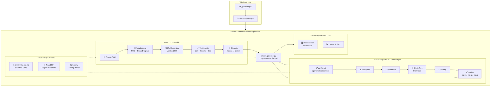
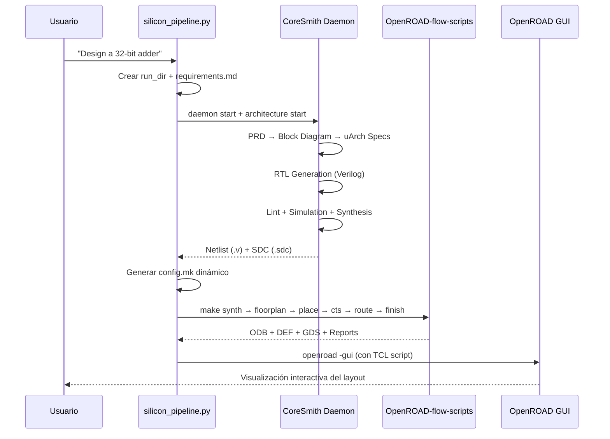

# 🔗 SiliconIA — Pipeline Integrado: Prompt → Semiconductor

## Arquitectura Final



## Archivos Creados

| Archivo | Ubicación | Propósito |
|---------|-----------|-----------|
| [`silicon_pipeline.py`](file:///C:/Users/carlo/SiliconIA/silicon_pipeline.py) | Raíz | Orquestador Python principal |
| [`pipeline_config.yaml`](file:///C:/Users/carlo/SiliconIA/pipeline_config.yaml) | Raíz | Configuración de rutas, PDK, LLM |
| [`Dockerfile`](file:///C:/Users/carlo/SiliconIA/Dockerfile) | Raíz | Imagen Docker unificada |
| [`docker-compose.yml`](file:///C:/Users/carlo/SiliconIA/docker-compose.yml) | Raíz | Orquestación Docker |
| [`run_pipeline.ps1`](file:///C:/Users/carlo/SiliconIA/run_pipeline.ps1) | Raíz | Launcher PowerShell |
| [`.dockerignore`](file:///C:/Users/carlo/SiliconIA/.dockerignore) | Raíz | Exclusiones de build |
| [`.env.example`](file:///C:/Users/carlo/SiliconIA/.env.example) | Raíz | Template de API keys |

> [!IMPORTANT]
> **Ningún archivo de los 3 proyectos originales fue modificado.** Toda la integración son archivos nuevos en la raíz de `SiliconIA/`.

## Cómo Usar

### Paso 1: Configurar API Key de Codex

```powershell
# Copiar y editar el archivo de entorno
copy C:\Users\carlo\SiliconIA\.env.example C:\Users\carlo\SiliconIA\.env
# Editar .env y agregar tu OPENAI_API_KEY o CODEX_API_KEY
```

### Paso 2: Construir la imagen Docker (primera vez, ~30-60 min)

```powershell
cd C:\Users\carlo\SiliconIA
.\run_pipeline.ps1 -Build
```

### Paso 3: Ejecutar el pipeline

```powershell
# Diseño simple desde un prompt
.\run_pipeline.ps1 "Design a 32-bit ripple carry adder"

# Diseño complejo desde un archivo de especificación
.\run_pipeline.ps1 -PromptFile .\spec.md

# Modo interactivo (escribes el spec línea por línea)
.\run_pipeline.ps1 -Interactive

# Auto-aprobar interrupciones de CoreSmith
.\run_pipeline.ps1 "8-bit counter with enable" -AutoApprove

# Sin GUI (ejecución headless)
.\run_pipeline.ps1 "ALU" -NoGUI

# Saltar CoreSmith y usar Verilog existente
.\run_pipeline.ps1 "my design" -SkipCoresmith -VerilogFiles rtl/top.v

# Abrir shell en el contenedor para debug
.\run_pipeline.ps1 -Shell
```

### Paso 4: Ver resultados

Los resultados se guardan en `C:\Users\carlo\SiliconIA\silicon-runs\<nombre>-<timestamp>\`:

```
silicon-runs/
  design_32_bit-20260929-023000/
    prompt.txt                    # Tu prompt original
    inputs/requirements.md        # Requisitos formateados
    rtl/                          # RTL generado por CoreSmith
    syn/output/                   # Netlist sintetizado
    pipeline_report.json          # Reporte completo del flujo
    .coresmith/                   # Logs y checkpoints
```

## Flujo Técnico Detallado

### Fase 1 → 2: CoreSmith genera, ORFS consume



### Conexión CoreSmith ↔ ORFS

El `silicon_pipeline.py` actúa como puente:

1. **CoreSmith produce** → `syn/output/<design>/<design>_netlist.v` + `.sdc`
2. **Pipeline genera** → `flow/designs/sky130hd/<design>/config.mk` dinámicamente
3. **ORFS consume** → el `config.mk` apunta al netlist y SDC de CoreSmith
4. **ORFS produce** → `results/sky130hd/<design>/base/6_final.odb` (+ GDS, DEF)
5. **Pipeline abre** → OpenROAD GUI con el `.odb` final

### Sky130 PDK — Presente en todo el flujo

El PDK Sky130 (`sky130_fd_sc_hd`) está integrado en ambos extremos:
- **CoreSmith** lo usa para síntesis con Yosys (Liberty, LEF)
- **ORFS** lo usa como plataforma target (`sky130hd`) para PnR
- Instalado via `volare` dentro del contenedor Docker en `/usr/share/pdk`

## Configuración Avanzada

Edita [`pipeline_config.yaml`](file:///C:/Users/carlo/SiliconIA/pipeline_config.yaml):

```yaml
# Cambiar modelo de LLM
llm:
  provider: codex
  codex_model: gpt-5.6-sol    # o gpt-4o, etc.

# Cambiar frecuencia target
pdk:
  target_clock_mhz: 100       # default: 50 MHz

# Cambiar utilización del core
orfs:
  core_utilization: 50         # default: 40%
```

## Troubleshooting

| Problema | Solución |
|----------|----------|
| Docker build falla | Verificar que Docker Desktop está corriendo con WSL2 |
| Codex no se conecta | Verificar `OPENAI_API_KEY` en `.env` |
| OpenROAD GUI no abre | Instalar VcXsrv o usar WSLg en Windows 11 |
| PDK no encontrado | Se instala automáticamente en el Docker build |
| CoreSmith se queda parado | Usar `-AutoApprove` o revisar interrupciones con `coresmith state` |
| ORFS falla en routing | Reducir `core_utilization` en `pipeline_config.yaml` |
